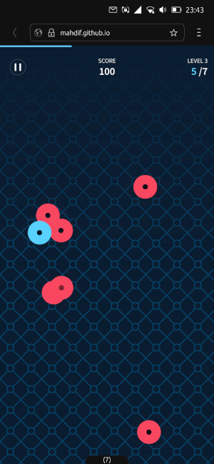
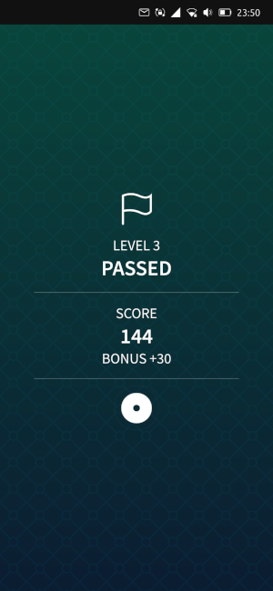

# Tap Tap Tap


Ubuntu Touch port of the HTML5 minigame by [MahdiF](https://github.com/MahdiF/taptaptap).

[](https://open-store.io/app/taptaptap.collaproductions)
[](https://t.me/collaproductions)

### Building the app (Ubuntu-based distros)

Install [clickable](https://clickable-ut.dev/en/latest/install.html):

```
$ sudo add-apt-repository ppa:bhdouglass/clickable
$ sudo apt-get install clickable
```

Clone this repository and build:

```
$ git clone https://github.com/nicolascolla/taptaptap.git
$ cd taptaptap
$ clickable
```

You can play the game on any web browser by opening taptaptap/www/index.html.

### Screenshots


